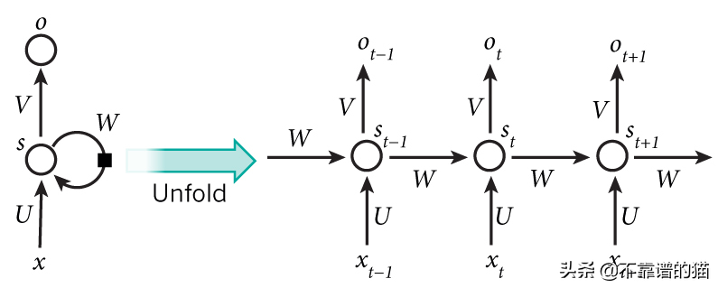
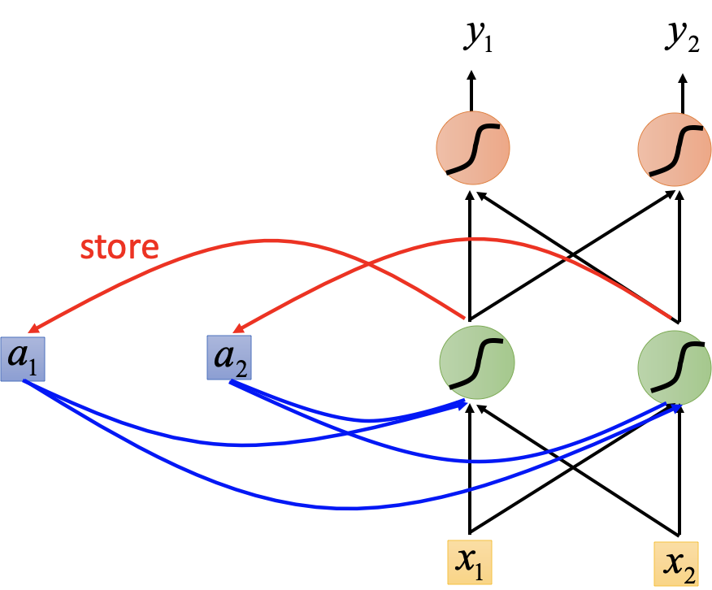
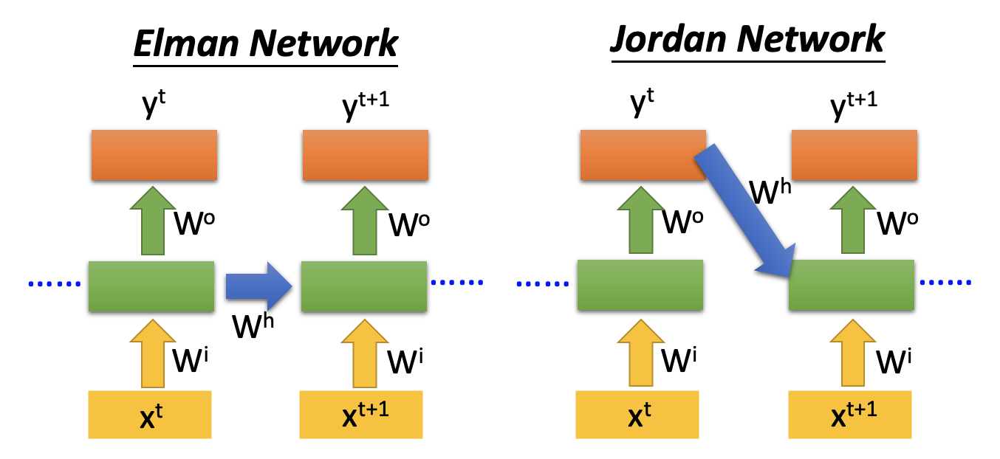
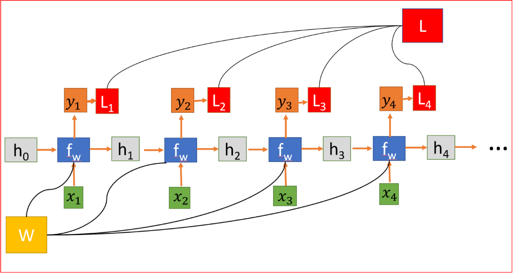

# RNN

## 简介

CNN 和普通的算法大部分都是输入和输出的一一对应，也就是一个输入得到一个输出。不同的输入之间是没有联系的。需要处理“序列数据 – 一串相互依赖的数据流”的场景就需要使用 RNN 来解决了。RNN 之所以能够有效的处理序列数据，主要是基于他的比较特殊的运行原理。RNN 跟传统神经网络最大的区别在于每次都会将前一次的输出结果，带到下一次的隐藏层中，一起训练。RNN 允许网络中出现环形结构，从而让一些神经元的输出反馈回来作为输入信号。这样的结构使 RNN 在 t 时刻的输出状态不仅与 t 时刻的输入有关，还与 t-1 时刻的网络状态有关，从而能处理与时间有关的动态变化。

在传统的神经网络中，可以理解所有输入和输出都是独立的。RNN之所以称为循环，是因为它们对序列的每个元素执行相同的任务，并且输出取决于先前的计算。RNN的另一种解释：这些网络具有“记忆”，考虑了先前的信息。

RNN 的结果与传统神经网络有一些不同，它带有一个指向自身的环，用来表示它可以传递当前时刻处理的信息给下一时刻使用，每一时刻的神经网络会传递信息给下一时刻。

### 分类

- Elman 网络：将隐层的参数传递给下一个迭代周期
- Jordan 网络：将输出值传递给下一个迭代周期

## 原理

隐藏状态连接来自前一个状态的信息，因此充当RNN的记忆。任何时间步的输出都取决于当前输入以及以前的状态。与其他对每个隐藏层使用不同参数的深层神经网络不同，RNN在每个步骤共享相同的权重参数。

### 训练方法

- BPTT：BackPropagation Through Time

