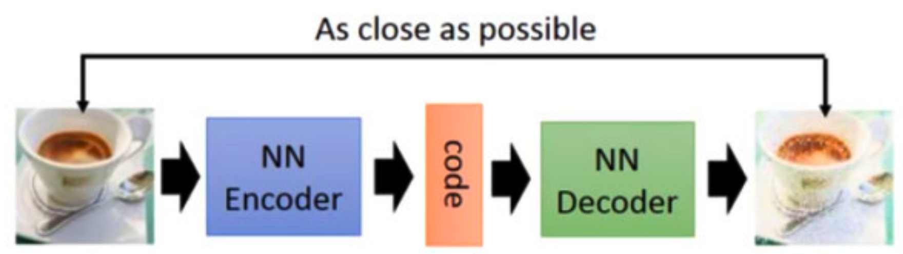
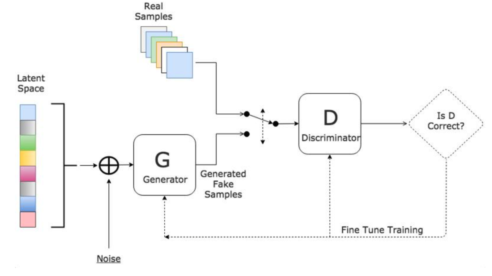

# 生成对抗网络GAN

## 简介

什么是生成（generation）？就是模型通过学习一些数据，然后生成类似的数据。让机器看一些动物图片，然后自己来产生动物的图片，这就是生成。

### auto-encoder（自编码器）

训练一个 encoder，把 input 转换成 code，然后训练一个 decoder，把 code 转换成一个 image，然后计算得到的 image 和 input 之间的 MSE（mean square error），训练完这个 model 之后，取出后半部分 NN Decoder，输入一个随机的 code，就能 generate 一个 image。但是 auto-encoder 生成 image 的效果，当然看着很别扭啦，一眼就能看出真假。

## 算法

GAN 有两个网络，一个是 generator，一个是 discriminator，从二人零和博弈中受启发，通过两个网络互相对抗来达到最好的生成效果。

- 生成器接收随机数并返回图像。
- 将生成的图像与从实际数据集中获取的图像流一起馈送到鉴别器中。
- 鉴别器接收真实和假图像并返回概率，0到1之间的数字，1表示真实性的预测，0表示假。

### 第一阶段：固定「判别器D」，训练「生成器G」

我们使用一个还 OK 判别器，让一个「生成器G」不断生成“假数据”，然后给这个「判别器D」去判断。一开始，「生成器G」还很弱，所以很容易被揪出来。但是随着不断的训练，「生成器G」技能不断提升，最终骗过了「判别器D」。到了这个时候，「判别器D」基本属于瞎猜的状态，判断是否为假数据的概率为50%。

### 第二阶段：固定「生成器G」，训练「判别器D」

当通过了第一阶段，继续训练「生成器G」就没有意义了。这个时候我们固定「生成器G」，然后开始训练「判别器D」。「判别器D」通过不断训练，提高了自己的鉴别能力，最终他可以准确的判断出所有的假图片。到了这个时候，「生成器G」已经无法骗过「判别器D」。

### 循环阶段一和阶段二

通过不断的循环，「生成器G」和「判别器D」的能力都越来越强。最终我们得到了一个效果非常好的「生成器G」，我们就可以用它来生成我们想要的图片了。

