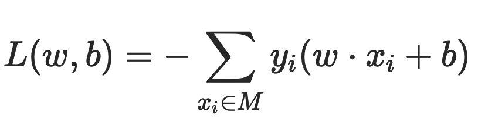
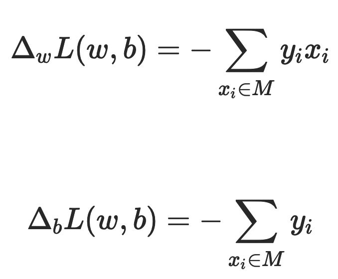
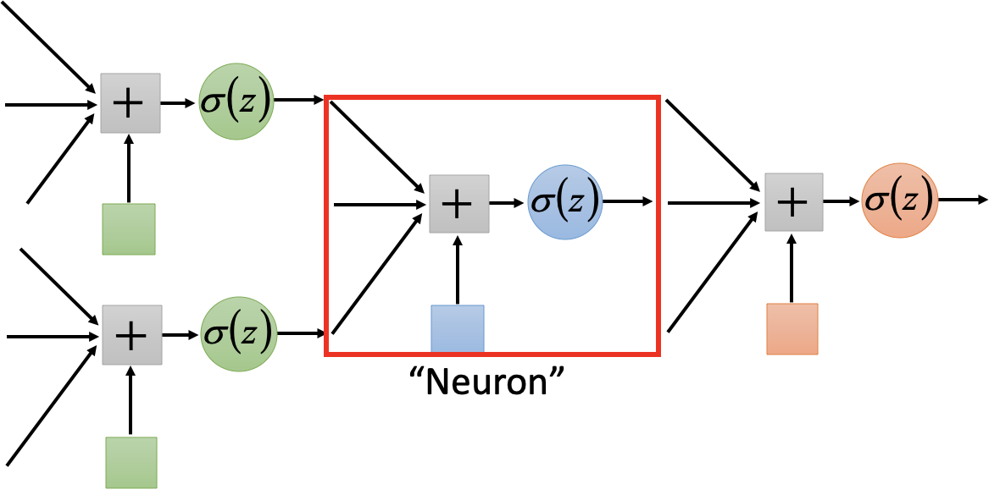
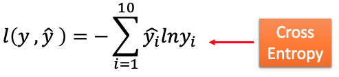
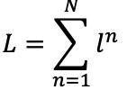
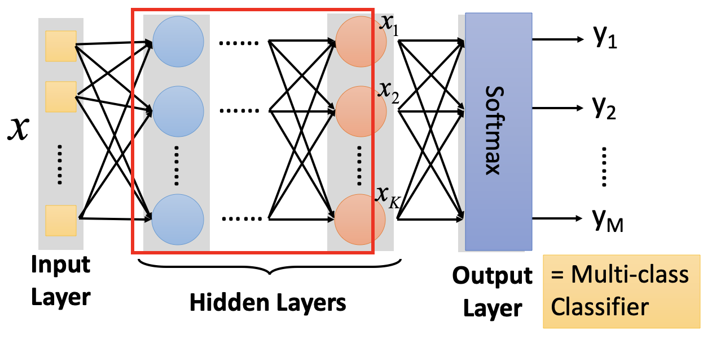
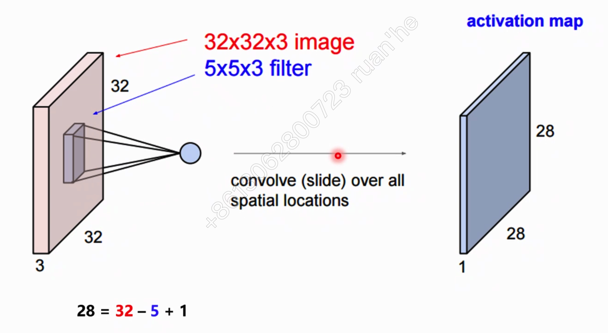
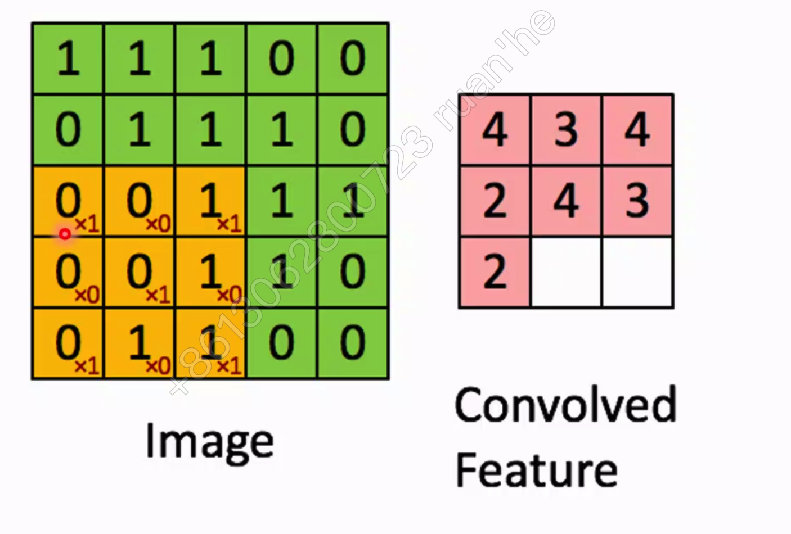
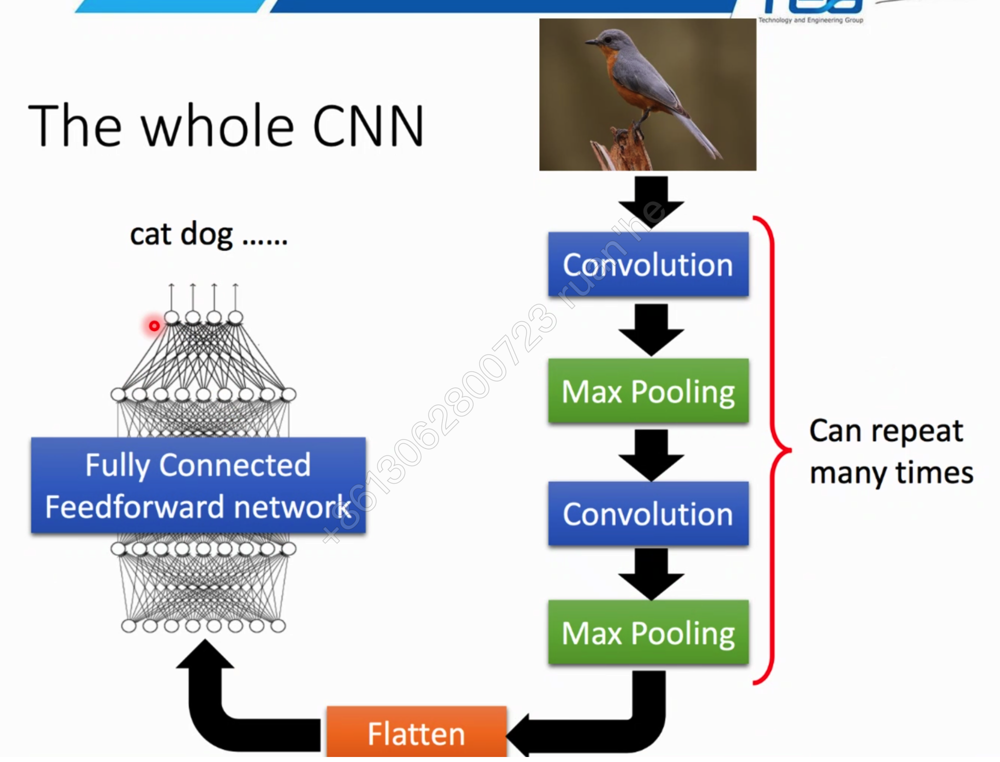

# 深度学习

## 简介

当神经网络层数比较多的时候，我们称它们为深度学习神经网络。

### 历史

-	1958: Perceptron (linear model)
-	1969: Perceptron has limitation
-	1980s: Multi-layer perceptron: Do not have significant difference from DNN today
-	1986: Backpropagation: Usually more than 3 hidden layers is not helpful
-	1989: 1 hidden layer is “good enough”, why deep?
-	2006: RBM initialization
-	2009: GPU
-	2011: Start to be popular in speech recognition
-	2012: win ILSVRC image competition 
-	2015.2: Image recognition surpassing human-level performance 
-	2016.3: Alpha GO beats Lee Sedol
-	2016.10: Speech recognition system as good as humans

### 深度学习 vs.  传统机器学习

- 传统机器学习的特征提取主要依赖人工，针对特定简单任务的时候人工提取特征会简单有效，但是并不能通用。
- 深度学习的特征提取并不依靠人工，而是机器自动提取的。这也是为什么大家都说深度学习的可解释性很差，因为有时候深度学习虽然能有好的表现，但是我们并不知道他的原理是什么。

## 感知机

感知机（Perceptron）是一种比较简单的二分类模型，将输入特征分类为 +1、-1 两类。它是由 2 层组成，输入层接收外部信号后传递给输出层。它是输出层进行激活函数的处理，也就是只拥有一个 neuron，所以学习能力有限。

例如，二维平面上的点只有两个输入特征（横轴坐标和纵轴坐标），一条直线就可以分类。如果输入数据有更多维度的特征，那么就需要建立同样多维度的模型，高维度上的分类模型也被称为超平面。

### 模型

感知机模型如下：``f(x)=sign(w⋅x+b)``

其中 x 代表输入的特征空间向量，输出空间是{-1, +1}，w 为权值向量，b 叫作偏置，sign 是一个符号函数：

w⋅x+b=0 为超平面的方程：当感知机输出为 +1 表示输入值在超平面的上方，当感知机输出为 -1 表示输入值在超平面的下方。训练感知机模型就是要计算出 w 和 b  的值，当有新的数据需要分类的时候，输入感知机模型就可以计算出 +1 或者 -1 从而进行分类。

### 损失函数

偏差之和就是感知机的损失函数：。其中 M 为误分类点集合，误分类点越少，损失函数的值越小；如果没有误分类点，损失函数值为 0。求模型的参数 w 和 b，就是求损失函数的极小值。

一般采用梯度下降法求损失函数极小值，实质上就是求导过程的数值计算方法。对于误分类点集合 M，损失函数 L(w,b) 变化的梯度，就是某个函数变量的变化引起的函数值的变化，根据感知机损失函数可知：

使用梯度下降更新 w 和 b，不断迭代使损失函数 L(w,b) 不断减小，直到为 0，也就是没有误分类点。感知机算法的实现过程：

- 1. 选择初始值 w0、b0。
  2. 在样本集合中选择样本数据 xiyi。
  3. 如果 yi(w⋅xi+b)<0，表示 yi 为误分类点，那么 w=w+ηyixi、b=b+ηyi，在梯度方向校正 w 和 b。其中 η 为步长，步长选择要适当，步长太长会导致每次计算调整太大出现震荡；步长太短又会导致收敛速度慢、计算时间长。
  4. 跳转回 2，直到样本集合中没有误分类点， 即全部样本数据 yi(w⋅xi+b)≥0。

## 神经网络

### 简介

人脑神经元可以通过感知机进行模拟，每个感知机相当于一个神经元，使用 sign 函数的感知机输出也是只有两个值，跟人脑神经元一样。

x1,x2,x3  相当于神经元的树突，实现信号的输入；sum()+b 及 sign 函数相当于神经元细胞，完成输入的计算；y  是神经元的输出。用数学形式表达的话是``y=sign(w1x1+w2x2+w3x3+b)``它是感知机 y=sign(w⋅x+b)  向量展开形式。

将感知机组成一层或者多层网络状结构，就构成了机器学习的神经网络（Neural Network）。在多层神经网络中，每一层都由多个感知机组成。将输入的特征向量 x 传递给第一层的每一个感知机，运算以后作为输出传递给下一层的每一个感知机，直到最后一层感知机产生最终的输出结果。这就是机器学习神经网络的实现过程，通过模拟人脑神经网络，利用样本数据训练每个感知机神经元的参数，在某些场景下得到的模型可以具有不可思议的效果。

### 算法

使用梯度下降算法，利用样本数据，可以训练神经网络、计算每个感知机的 w 和 b 参数值。当所有的感知机参数都计算出来，神经网络也就训练出来了。

训练神经网络的时候采用一种**反向传播**的算法，针对每个样本，从最后一层，也就是输出层开始，利用样本结果使用梯度下降算法计算每个感知机的参数。然后以这些参数计算出来的结果作为倒数第二层的输出计算该层的参数。然后逐层倒推，反向传播，计算完所有感知机的参数。

#### Model

也就是 network structure

#### Lost Function

- 每个 lost：
- total lost：

#### Best Function

还是采用梯度下降法

后续会采用 backprogapation 来有效的算 ∂L∕∂w。

##Network Structure

一个NN就是一个model（function set），需要自己去设计layer数，每个层有多少个neuron等，是设计这个model

### 两层神经网络

当选择两层神经网络的时候，原始感知机的 sign 函数表现并不太好，更常用的是 sigmoid 函数。

### 两层以上的多层神经网络

对于两层以上的多层神经网络，ReLU 函数的效果更好一些。ReLU  函数表达式非常简单``y=max(x,0)``当 x 大于 0，输出 x；当 x 小于 0，输出 0。

### 前馈网络

前馈深度网络（Feedforward Network）或多层感知机（multilayer perceptron,MLP）

- 多层神经元网络
- 每一层是全连接的

#### Matrix Operation

#### Multi-classifier

### CNN

- 用一层全扫一遍图，检测是否是有鸟嘴，。

- 每一行的扫描叫做一个卷积操作：

- 另一层扫描全图的鸟脚

- 压缩原图片

- 

  

### RNN

## 分类

- Supervised
- Unsupervised

## 

