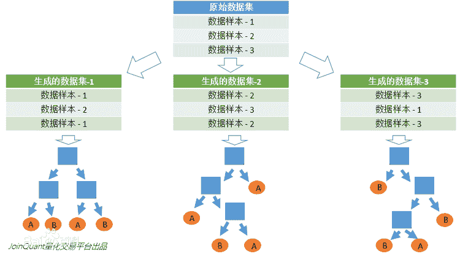
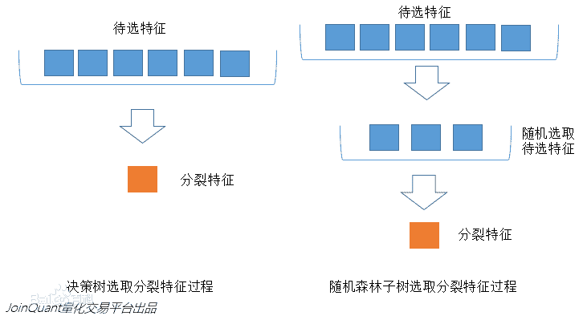

# 随机森林

## 简介

随机森林（Random Forest）是以决策树为个体学习器构建 Bagging 集成的基础上，进一步在决策树的训练过程中引入随机属性选择。随机森林包含多个决策树的个体学习器，每一个个体学习器都是一棵决策树。所以随机森林既可以做分类，又可以做回归。

它在得到森林之后，当有一个新的输入样本进入的时候，就让森林中的每一棵决策树分别进行一下判断，看看这个样本应该属于哪一类，然后看看哪一类被选择最多，就预测这个样本为那一类。随机森林可以既可以处理属性为离散值的量，比如 ID3 算法，也可以处理属性为连续值的量，比如 C4.5 算法。当它做分类的时候，输出结果是每个子分类器的分类结果中最多的那个。可以理解是每个分类器都做投票，取投票最多的那个结果。当它做回归的时候，输出结果是每棵 CART 树的回归结果的平均值。

## 原理

- 随机行采样：假如有 N 个样本，则有放回的随机选择 N 个样本（每次随机选择一个样本，然后返回继续从全量样本中选择，最终凑满 N 个样本）。这选择好了的 N 个样本用来训练一棵决策树，作为决策树根节点处的样本。采取有放回的抽样方式构造子数据集，保证不同子集之间的数量级一样，使得随机森林中的决策树更普遍化一点，适合更多的场景。利用子数据集来构建子决策树，将这个数据放到每个子决策树中，每个子决策树输出一个结果。
- 随机列采样：子树从所有的待选特征中随机选取一定的特征，决策树在所选取的一定特征中通过如信息增益等算法选取最优的分裂特征。当每个样本有 M 个属性时，随机从这 M 个属性中选取出 m 个属性，满足条件 m << M。然后在决策树的每个节点需要分裂时，从这 m 个属性中采用某种策略（如信息增益）来选择 1 个属性作为该节点的分裂属性。
- 形成决策树：决策树形成过程中每个节点都要按照第二步进行分裂（很容易理解，如果下一次该节点选出来的那一个属性是刚刚其父节点分裂时用过的属性，则该节点已经达到了叶子节点，无须继续分裂了），一直到不能够再分裂为止。注意整个决策树形成过程中没有进行剪枝。
- 按照以上 3 个步骤建立大量的决策树，这样就构成了随机森林了。

通过这两个随机化，从而使得随机森林中的决策树都能够彼此不同，提升系统的多样性，从而提升分类性能。然后统计子决策树的投票结果，得到最终的分类就是随机森林的输出结果。

### 随机属性选择

传统的决策树在选择分属性时是在当前结点的属性集合中选择一个最优属性。而在 RF 中，对于个体学习器决策树的每个结点，先从该结点的属性集合中随机选择一个子集，然后再从这个子集中选择最优属性用于划分。一般情况下，推荐 $子集大小=log_2总集大小$。

随机森林对 Bagging 做了优化，但与 Bagging 中仅通过样本扰动不同，随机森林还额外做了属性扰动，这就使得最终集成的泛化性可能通过个体学习器之间的差异而进一步增加。

## 种类

### extra trees

Extra trees 是 RF 的一个变种，原理几乎和 RF 一模一样，仅有区别有：

- 对于每个决策树的训练集，RF 采用的是随机采样 bootstrap 来选择采样集作为每个决策树的训练集，而extra trees 一般不采用随机采样，即每个决策树采用原始训练集。
- 在选定了划分特征后，RF 的决策树会基于基尼系数、均方差之类的原则，选择一个最优的特征值划分点，这和传统的决策树相同。但是 extra trees 比较的激进，他会随机的选择一个特征值来划分决策树。

从第二点可以看出，由于随机选择了特征值的划分点位，而不是最优点位，这样会导致生成的决策树的规模一般会大于 RF 所生成的决策树。也就是说，模型的方差相对于 RF 进一步减少，但是偏倚相对于 RF 进一步增大。在某些时候，extra trees 的泛化能力比 RF 更好。

### TRTE

TRTE（Totally Random Trees Embedding）是一种非监督学习的数据转化方法。它将低维的数据集映射到高维，从而让映射到高维的数据更好的运用于分类回归模型。我们知道，在 SVM 中运用了核方法来将低维的数据集映射到高维，此处 TRTE 提供了另外一种方法。

TRTE 在数据转化的过程也使用了类似于 RF 的方法，建立 T 个决策树来拟合数据。当决策树建立完毕以后，数据集里的每个数据在T个决策树中叶子节点的位置也定下来了。

比如有 3 颗决策树，每个决策树有 5 个叶子节点，某个数据特征 𝑥 划分到第一个决策树的第 2 个叶子节点，第二个决策树的第 3 个叶子节点，第三个决策树的第 5 个叶子节点。则 x 映射后的特征编码为 (0,1,0,0,0,   0,0,1,0,0,   0,0,0,0,1)，有15维的高维特征。这里特征维度之间加上空格是为了强调三颗决策树各自的子编码。映射到高维特征后，可以继续使用监督学习的各种分类回归算法了。

## 总结

许多研究表明， 组合分类器比单一分类器的分类效果好，随机森林是一种利用多个决策树对数据进行判别与分类的方法，它在对数据进行分类的同时，还可以给出各个变量（基因）的重要性评分，评估各个变量在分类中所起的作用。

随机森林算法得到的随机森林中的每一棵都是很弱的，但是大家组合起来就很厉害了。可以这样比喻随机森林算法：每一棵决策树就是一个精通于某一个窄领域 的专家（因为我们从 M 个特征中选择 m 让每一棵决策树进行学习），这样在随机森林中就有了很多个精通不同领域的专家，对一个新的问题（新的输入数 据），可以用不同的角度去看待它，最终由各个专家投票得到结果。而这正是群体智慧（swarm  intelligence），也是这样一个分布式的分类系统，由每一自己子领域里的专家利用自己独有的默会知识去对一项产品进行分类，决定是否需要生产。随机森林的效果取决于多个分类树要相互独立，不出现 overfiting，独立选取自己的特征 。

优点

- 不易陷入过拟合：两个随机性的引入，使得随机森林不易陷入过拟合。
- 很好的抗噪声能力：两个随机性的引入，使得随机森林具有很好的抗噪声能力。
- 能够处理很高维度（特征很多）数据：能处理高纬度数据，并且不用做特征选择
- 对数据集的适应能力强：既能处理离散型数据，也能处理连续型数据，数据集无需规范化
- 训练速度快：可以得到变量重要性排序，可以做并行处理
- 在训练过程中，能够检测到特征间的互相影响
- 实现比较简单

缺点：

- 在某些噪音比较大的样本集上，RF 模型容易陷入过拟合。
- 取值划分比较多的特征容易对 RF 的决策产生更大的影响，从而影响拟合的模型的效果。