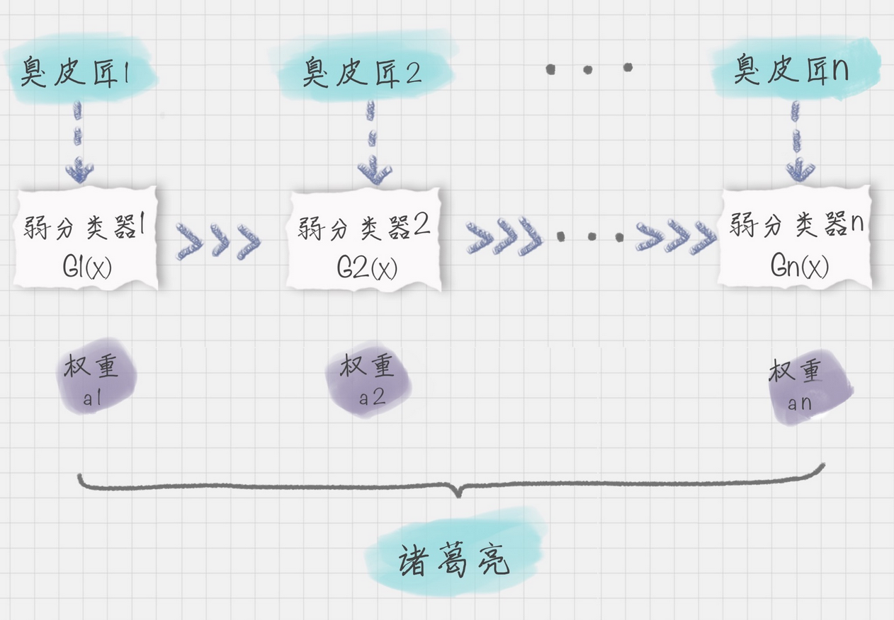

# AdaBoosting

## 简介

AdaBoost（Adaptive Boosting）由 Freund 等人于 1995 年提出，是一种 Boosting 算法。AdaBoost 算法是一个框架，可以指定任意的个体分类器，通常可以采用 CART 分类器作为个体分类器。

## 原理

AdaBoost 针对整个训练集的数据应用不同的弱分类器 $$G_i(x)$$，而且最终强分类器是一个由 K 个弱分类器组成的 $f(x)=\displaystyle \sum_{i=1}^n a_iG_i(x)$。如果个体分类器的分类效果好，那么权重应该比较大，如果个体分类器的分类效果一般，权重应该降低。

## 具体步骤

- 初始化样本集权重为 $𝐷_1=(𝑤_{11},𝑤_{12},...𝑤_{1𝑚});𝑤_{1𝑖}=\frac{1}{𝑚}; 𝑖=1,2...𝑚$

- 对于 k=1,2, ..., K：
  - 选择当前“权重训练集” $D_k$ 训练获得最优弱分类器 $G_i(x)$
- 计算该弱分类器针对“权重训练集”的“权重错误率” $𝑒_𝑘=\sum_{𝑖=1}^𝑚 𝑤_{𝑘𝑖}𝑒_{𝑘𝑖}$
  - 计算本轮迭代最优弱分类器在强分类器中的系数 $a_i=\frac{1}{2}log\frac{1-e_i}{e_i}$
- 更新样本集 $D_{k+1}=(w_{k+1,1},w_{k+1,2}...,w_{k+1,N})$ 的权重分布为 $w_{k+1,i}=\frac{w_{k,i}}{Z_k}exp(-a_ky_iG_k(x_i)),i=1,2,...,N$，这里 $𝑍_𝑘$ 是规范化因子 $Z_k=\sum_{i=1}^Nw_{k,i}exp(-a_ky_iG_k(x_i))$
- 构建最终强学习器为：$f(x)=\displaystyle \sum_{i=1}^n a_iG_i(x)$

AdaBoost 算法是通过改变样本的数据分布来实现下一轮最优分类器的选择。AdaBoost 会判断每次训练的样本是否正确分类，对于正确分类的样本，降低它的权重，对于被错误分类的样本，增加它的权重。再基于本轮得到的分类准确率，来确定这次训练样本中每个样本的权重。然后将修改过权重的新数据集传递给下一轮迭代的分类器进行训练，第 k+1 轮中的样本权重，是根据该样本在第 k 轮的权重以及第 k 个分类器的准确率而定。这样做的好处就是，通过每一轮训练样本的动态权重，可以让训练的焦点集中到难分类的样本上，最终得到的弱分类器的组合更容易得到更高的分类准确率。

当然在每一轮的训练中，我们都需要从众多“臭皮匠”中选择一个拔尖的，也就是这一轮训练评比中的最优“臭皮匠”，对应的就是错误率最低的分类器。当然每一轮的样本的权重都会发生变化，这样做的目的是为了让之前错误分类的样本得到更多概率的重复训练机会。

## Lab

- [Adaboost 分类](20_adaboost-classify.ipynb)
- [Adaboost 分类](22_adaboost-classify.ipynb)
- [Adaboost 回归 Boston](26_adaboost-regressor-boston.ipynb)
- [Adaboost 回归](28_adaboost-regressor.ipynb)

