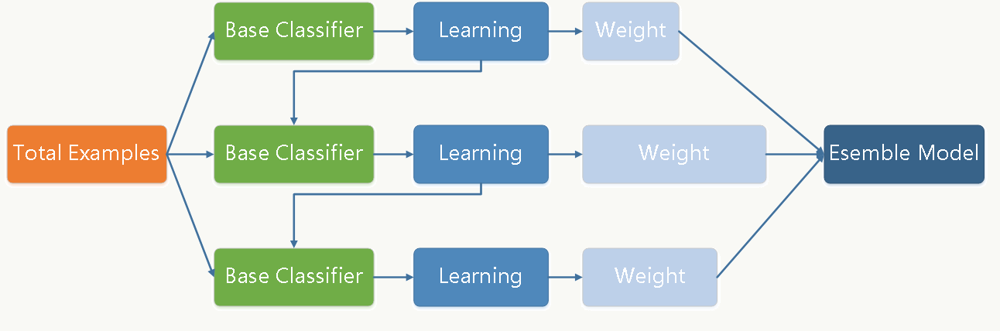

# GBDT

## 简介

GBDT（Gradient Boosting Decison Tree）是通过加法模型（即基函数的线性组合），以及不断减小训练过程产生的残差来达到将数据分类或回归的算法。GBDT 通过多轮迭代，每轮迭代产生一个弱分类器，每个分类器在上一轮分类器的**残差**基础上进行训练，通过降低偏差来不断提高最终分类器的精度。对弱分类器的要求一般是足够简单，并且是低方差和高偏差的，弱分类器一般采用决策树的 CART 树。由于上述高偏差和简单的要求，每个分类回归树的深度不会很深，最终的总分类器是将每轮训练得到的弱分类器加权求和得到的。

GBDT 的原理就是让所有弱分类器的结果相加等于预测值。在此过程中，让下一个弱分类器去拟合上一个误差函数对预测值的残差（这个残差就是预测值与真实值之间的误差）。当然了，它里面的弱分类器的表现形式就是各棵树。例如，我今年 30 岁了，但 GBDT 并不知道我今年多少岁，那 GBDT 咋办呢？

- 它会在第一个弱分类器（或第一棵树中）随便用一个年龄比如20岁来拟合，然后发现误差有10岁；
- 接下来在第二棵树中，用6岁去拟合剩下的损失，发现差距还有4岁；
- 接着在第三棵树中用3岁拟合剩下的差距，发现差距只有1岁了；
- 最后在第四课树中用1岁拟合剩下的残差，完美。
- 最终，四棵树的结论加起来，就是真实年龄30岁。

## 残差

假设现在有样本集 $(x_1, y_1), (x_2,y_2),...(x_n, y_n)$，用模型 $F(x)$ 去拟合该数据集，使得这批样本的平方损失函数（即 $\frac{1}{2}\sum_0^n(y_i-F(x_i)^2)$ ）最小。但发现虽然模型的拟合效果很好，但仍然有一些差距，比如预测值 $F(x_1)=0.8$ 而真实值 $y_1=0.9$，$F(x_2)=1.4$ 而真实值 $y_2=1.3$ 等。**在不允许更改原来模型的参数的情况下，那如何进一步来提高模型的拟合能力？**既然不能更改原来模型的参数，那么意味着必须在原来模型的基础之上做改善，最直观的做法就是建立一个新的模型 $f(x)$ 来拟合 $F(x)$ 未完全拟合真实样本的残差，即 $y-F(x)$。所以对于新的数据集来说，拟合的样本集就变成了：$(x_1,y1-F(x_1)), (x_2, y_2-F(x_2)),...(x_n,y_n-F(x_n))$。

$y_i-F(x_i)$ 被称为残差，这一部分也就是原先的模型 $F(x_i)$ 未能完全拟合的部分，所以交给新的模型来完成。GBDT（Gradient Boosting Decision Tree）中的 gradient 被称为梯度，也就是一阶导。对比原先模型中的损失函数-平方损失函数 $\frac{1}{2}\sum_0^n(y_i-F(x_i)^2)$ ，它的一阶导其实就是残差的形式。实际工程中，gbdt是计算负梯度，用负梯度近似残差。

## 算法

在 GBDT 的迭代中，假设前一轮迭代得到的强学习器是 $𝑓_{𝑡−1}(𝑥)$、 损失函数是 $L(y,f_{t-1}(x))$。本轮迭代的目标是找到一个 CART 回归树模型的弱学习器 $h_t(x)$，让本轮的损失函数 $L(y,f_{t}(x))=L(y,f_{t-1}(x)+h_t(x))$ 最小。也就是本轮迭代找到决策树，要让样本的损失尽量变得更小。

模型最终描述为：$F_m(x)=\sum_{m=1}^MT(x;\theta_m)$，模型一共训练 M 轮，每轮产生一个弱分类器 $T(x;\theta_m)$。

$F_{m−1}(x)$ 为当前的模型，gbdt 通过经验风险极小化来确定下一个弱分类器的参数。具体到损失函数本身 L 的选择，有平方损失函数，0-1损失函数，对数损失函数等等。如果选择平方损失函数，那么这个差值其实就是平常所说的残差。

