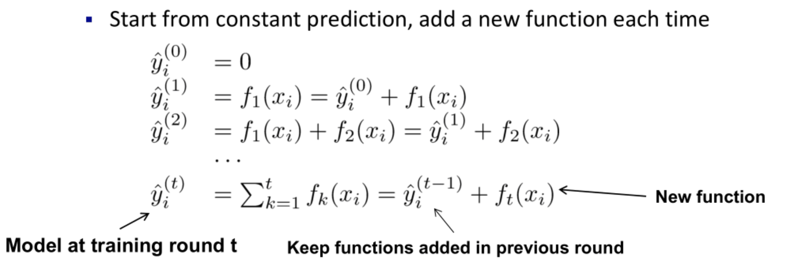

# XGBoost

## 简介

XGBoost是2016年由华盛顿大学陈天奇老师带领开发的一个可扩展机器学习系统，XGBoost 本质上还是一个 GBDT，并对模型中的算法进行了诸多优化，所以叫 X(Extreme)GBoosted。

XGBoost的核心算法思想是：

1. 不断地添加树，不断地进行特征分裂来生长一棵树，每次添加一个树，其实是学习一个新函数 f(x) 去拟合上次预测的残差。
2. 当训练完成得到 k 棵树。
3. 要预测一个样本的预测分数时，其实就是根据这个样本的特征在 k 棵树中的每棵树中会落到对应的一个叶子节点，每个叶子节点就对应一个分数。只需要将每棵树对应的分数加起来就是该样本的预测值。

显然，我们的目标是要使得树群的预测值尽量接近真实值，而且有尽量大的泛化能力。类似之前 GBDT 的套路，XGBoost 也是需要将多棵树的得分累加得到最终的预测得分（每一次迭代，都在现有树的基础上，增加一棵树去拟合前面树的预测结果与真实值之间的残差）。

### XGBoost vs. GBDT

除了算法上与传统的 GBDT 有一些不同外，XGBoost 还在工程实现上做了大量的优化:

1. GBDT 是学习算法，XGBoost 是该算法的工程实现。
2. 在使用 CART 树作为基分类器时，XGBoost 显式地加入了正则项来控制模型的复杂度，有利于防止过拟合，从而提高模型的泛化能力。
3. GBDT 在模型训练时只使用了代价函数的一阶导数信息，XGBoost 对代价函数进行二阶泰勒展开，可以同时使用一阶和二阶导数。
4. 传统的 GBDT 采用 CART 作为基分类器，XGBoost 支持多种类型的基分类器，比如线性分类器。
5. 传统的 GBDT 在每轮迭代时使用全部的数据，XGBoost则采用了与随机森林相似的策略，支持对数据进行采样。
6. 传统的 GBDT 没有设计对缺失值进行处理，XGBoost 能够自动学习出缺失值的处理策略。

## 参数

### 一般参数

- booster：弱分类器类型
- nthread：并行线程数

### 每个分类器参数

### 学习目标参数

- objective：损失函数
- eval_metric：模型性能评估函数

