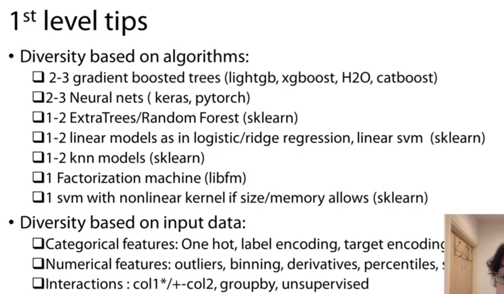

# Stacking

## 简介

集成学习中，当训练数据很多时，“学习法”是一种强大的结合策略，即通过另一个学习器来进行结合。Stacking 是学习法的典型代表，把个体学习器称为初级学习器，用于结合的学习器称为次级学习器。

### 原理

Stacking 先从初始训练集训练出初级学习器，然后“生成”一个新数据集用于训练次级学习器。在这个新数据集中，初级学习器的输出被当做样例输入特征，而初始样本的标记仍被当做样例标记。

Stacking是指训练一个模型用于组合（combine）其他各个模型。即首先训练多个不同的模型，然后再以之前训练的各个模型的输出为输入来训练一个“组合”模型，以得到一个最终的输出。如果可以选用任意一个组合算法，那么理论上，Stacking 可以表示之前提到的各种Ensemble方法。然而，实际中，通常使用单层逻辑回归作为组合模型。

## 最佳实践

### 1st Level

### 多层

每 7.5 个 model，需要多加一个 meta-model

