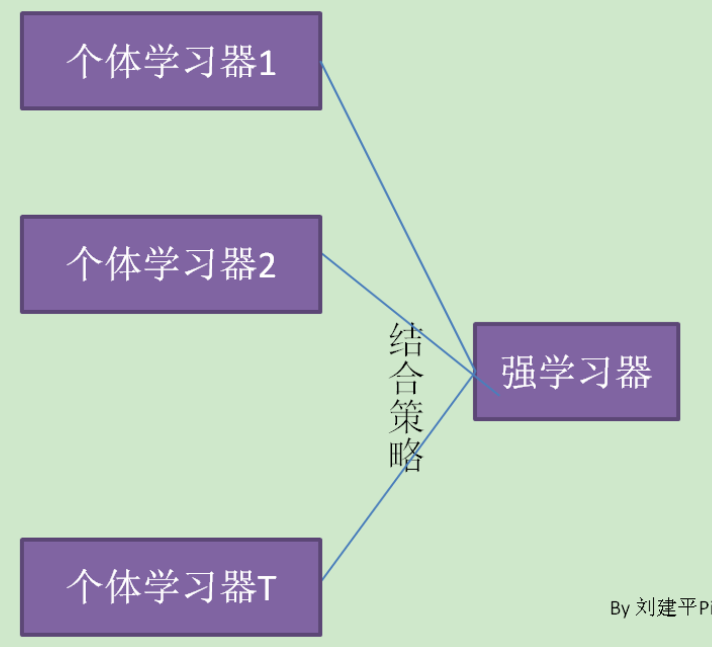

# 集成学习

## 简介

集成学习通过构建并结合多个学习器来完成学习任务，其结构为先产生一个个体学习器，再用某种策略将它们结合起来。集成学习通过将多个学习器进行结合，常可获得比单一学习器显著优越的泛化性能，这对“弱学习器”尤为明显。集成学习有两个主要的问题需要解决，第一是如何得到若干个个体学习器，第二是如何选择一种结合策略，将这些个体学习器集合成一个强学习器。

## 个体学习器

### 同质 vs. 异质

- 同质：集成中只包含同种类型的个体学习器，比如都是决策树个体学习器，或神经网络个体学习器。
- 异质：集成中同时包含不同类型的个体学习器。如有一个分类问题，对训练集采用支持向量机个体学习器，逻辑回归个体学习器和朴素贝叶斯个体学习器来学习，再通过某种结合策略来确定最终的分类强学习器。

同质个体学习器的应用是最广泛的，一般常说的集成学习的方法都是指的同质个体学习器。而同质个体学习器使用最多的模型是 CART 决策树和神经网络。同质个体学习器按照个体学习器之间是否存在依赖关系可以分为两类：第一个是个体学习器之间存在强依赖关系，一系列个体学习器基本都需要串行生成，代表算法是 boosting 系列算法，第二个是个体学习器之间不存在强依赖关系，一系列个体学习器可以并行生成，代表算法是 bagging 和随机森林算法。

### 准确性 vs. 多样性

要获得好的集成，个体学习器应“好”（准确性）而“不同”（多样性），即个体学习器要有一定的“准确性”，而且要有“多样性”，使学习器间具有差异。

假设个体分类器的错误率相互独立，则由 Hoeffding 不等式可知，集成的错误率随着集成中个体分类器数目的增大，集成的错误率将指数级下降，最终趋向于 0。

但个体分类器的“准确性”和“多样性”本身就存在冲突。一般，准确性很高之后，要增加多样性就需牺牲准确性。如何产生“好而不同”的个体学习器是集成学习研究的核心。

### 优缺点

#### 优点

- 从通的角度来说，学习任务的假设空间很大，可能有多个假设在训练集上达到同等性能，此时若使用单个学习器可能因误选而导致泛化性能不佳，结合多个学习器则会减少这类风险。
- 学习器往往会陷入局部极小，从而造成对应的泛化性能糟糕，而通过多个学习器结合之后，可降低局部极小点的风险。
- 有些学习任务的真实假设可能不在当前学习算法所考虑的假设空间中，此时若使用单个学习器则无效，而通过多个学习器的集成则有助于扩大假设空间，可能学得更好的结果。

## 结合策略

### 平均法

对于数值类的回归预测问题，通常使用的结合策略是平均法，也就是说，对于若干个弱学习器的输出进行平均得到最终的预测输出。

- 简单平均法：
- 加权平均法：加权学习法可认为是集成学习的基本出发点。对应给定的个体学习器，不同的集成学习可以视为通过不同的方式来确定加权平均法中的权重。而权重一般是从训练集中学习而得。
- 条件平均法：

### 投票法

对于分类问题的预测，我们通常使用的是投票法。主要用于分类问题：

- 绝对多数投票法：某标签结果超过半数，否则拒绝预测
- 相对多数投票法：预测为得票最多的标记
- 加权投票法：

### 学习法

对弱学习器的结果做平均或者投票，相对比较简单，但是可能学习误差较大，于是就有了学习法这种方法。当使用学习法的结合策略时，不是对弱学习器的结果做简单的逻辑处理，而是再加上一层学习器。也就是说，将训练集弱学习器的学习结果作为输入，将训练集的输出作为输出，重新训练一个学习器来得到最终结果。“学习法”结合策略通过另一种学习器来进行结合，把用于结合的学习器称为元学习器（meta-learner）。

在这种情况下，将弱学习器称为初级学习器，将用于结合的学习器称为次级学习器。对于测试集，我们首先用初级学习器预测一次，得到次级学习器的输入样本，再用次级学习器预测一次，得到最终的预测结果。

Stacking 是学习法的典型代表，Stacking 先从初始训练集中训练出个体学习器，然后再生成一个新的训练集用于训练元学习器。在这个新的数据集中，初级学习器的输出被当做输入样例特征。

## 多样性增强

- 数据样本扰动
- 输入属性扰动
- 输出表示扰动
- 算法参数扰动：随着设置算法不同参数，如隐层数、神经元数、初始连接权值等

