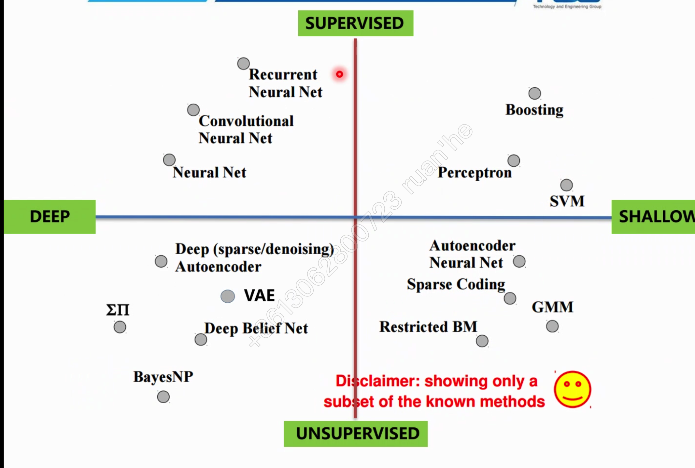
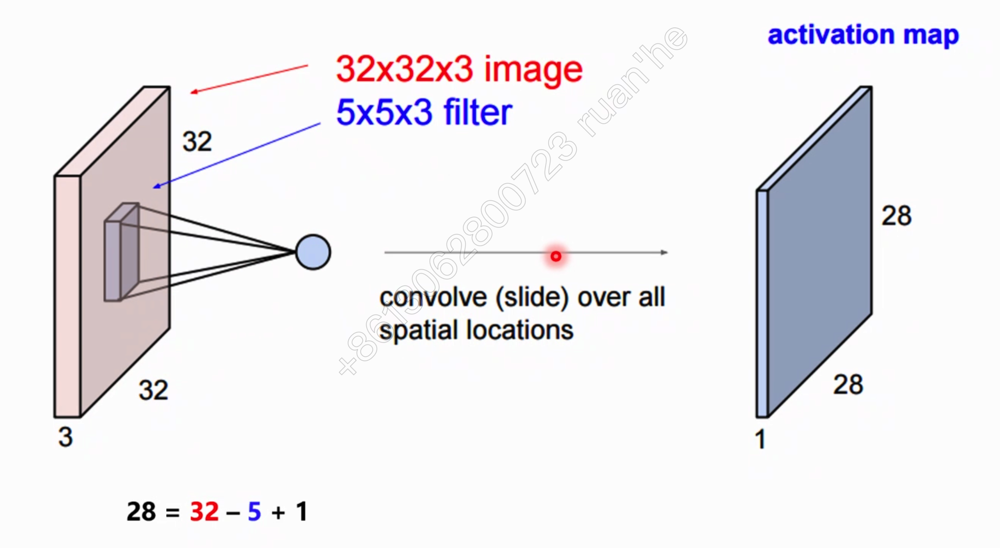
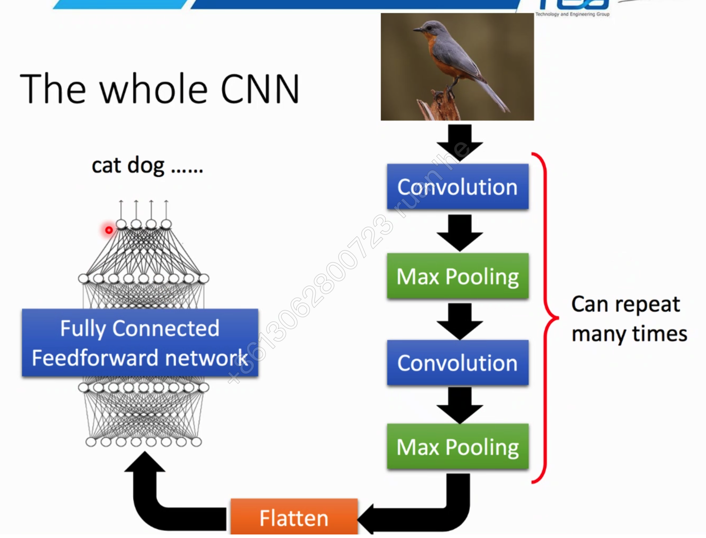

# Deep Learning

## 简介

- 分类：supervised、unsupervised learnng、renforcement（ 

##Network Structure

### 前馈网络

- 多层神经元网络
- 每一层是全连接的

### CNN

-  用一层全扫一遍图，检测是否是有鸟嘴，。

- 每一行的扫描叫做一个卷积操作：

- 另一层扫描全图的鸟脚

- 压缩原图片

- 

  

### RNN

##Lost Function

### Regression

### Classification

##优化算法

 